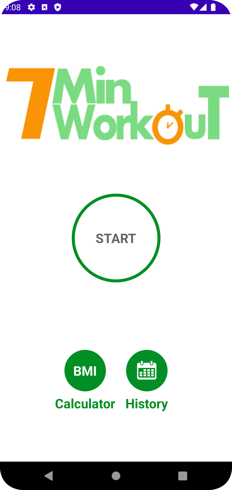
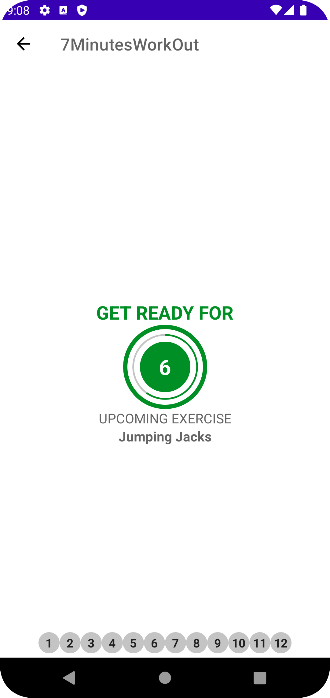
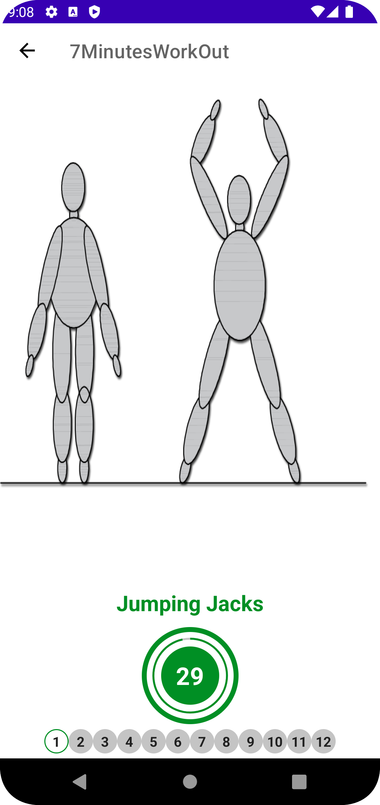
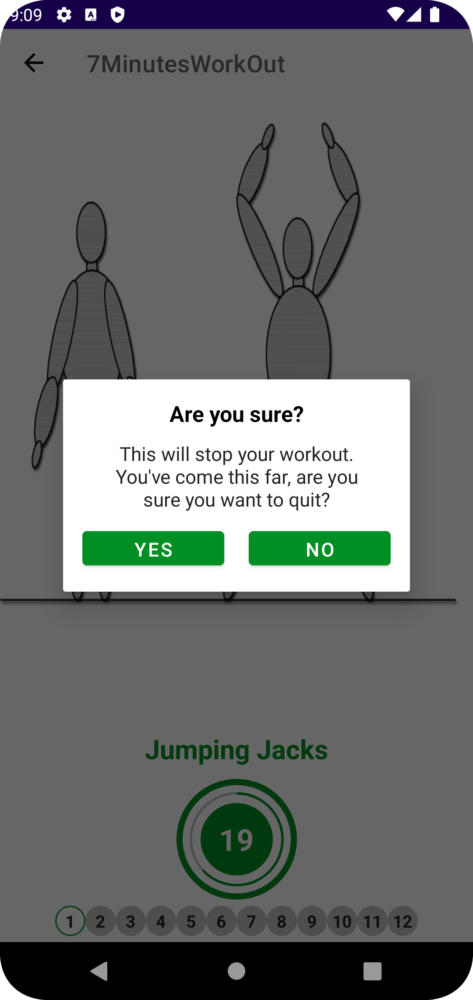
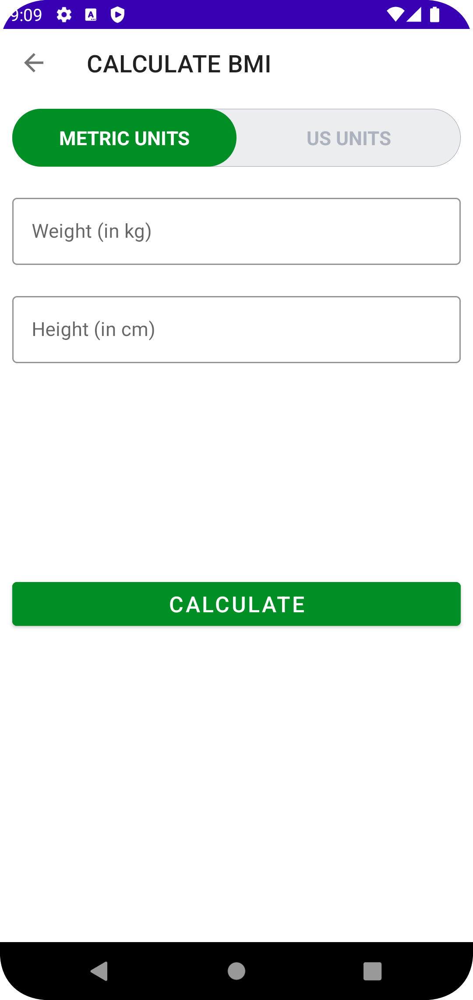
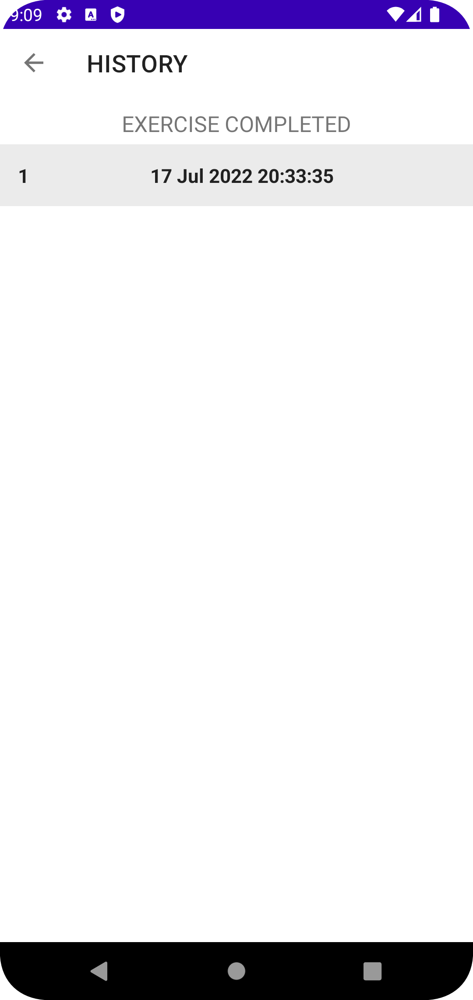

#  7 Minutes WorkOut App

>This is my first Android App. It uses Kotlin with stored data to provide user with 7 minutes workout, BMI Calculator. It also logs and stores these workouts using Android Room Database.

